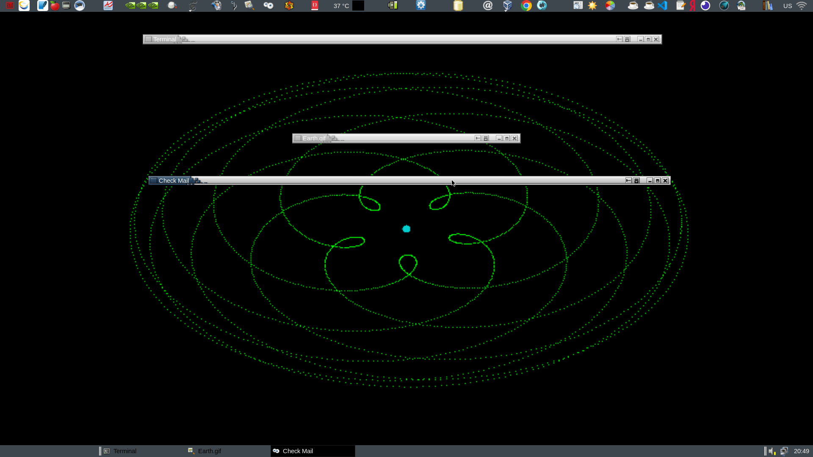

# wf-external-decoration
[Wayfire]: https://wayfire.org
[ammen99]: https://github.com/ammen99/wf-basic-deco/tree/master
[marco]: https://wiki.mate-desktop.org/mate-desktop/components/marco/

A [Wayfire] decoration plugin that uses a external executable as a client responsible for the rendering.

It is a implementation of the [ammen99]'s idea.

The project is composed by a Wayfire plugin and a external executable communicating through a wayland
protocol, defined in the proto folder.

For this executable I used gtk3 and the rendering engine of [marco], the Mate Desktop's windows manager.
The same rendering is used too in the latest versions of compiz (gtk-window-decorator).

It parses and renders metacity themes of all versions, i.e. v1, v2 and v3. 
The executable reads its configuration from a json file defining the theme name, the buttons layout
for toplevel and dialogs and the title font. It relies on the gtk3 theming for the background and title
color, but you can override them editing the theme definition.

The supported buttons are: minimize, maximize, close, stick and shade.

NOTE: Not all metacity themes out there support the stick and shade buttons, only those made for marco do.

Metacity themes have a menu button that would be ideal for a menu of actions on the window, but I don't know how to show a menu from a plugin.

And finally... I used C++ between 1998 and 2003, it changed a bit ! 

I struggled to get up to date for the task, but almost certainly some things could be done better. 
The same is valid for Wayfire, I only scratched its surface.

## Dependencies

Wayfire 0.8.x

Gtk3 >= 3.24

## Installing

Go to the source folder, setup meson, compile and install.

```sh
$ cd your-path/wf-external-decoration
$ meson setup build
$ ninja -C build
$ sudo ninja -C build install
```
## Configuration

The plugin has an entry for views to be ignored, with the same rules as the default decoration plugin.

The executable searches the json file XDG_CONFIG_HOME/wf-metacity-decorator/config.json.

The format and default values are:

``` sh
{
    "theme": "ClearlooksRe",                          
    "button-layout": "menu:minimize,maximize,close",  // left: menu, right: minimize,maximize,close
    "dialog-button-layout": ":close",                 // only close on the right
    "font": "Bitstream Vera Sans Book 11"
}
```

The font must be a string acceptable by **pango_font_description_from_string**, don't forget the size !
The font height determines the height of the buttons.
 
The buttons layouts must be in the format: 

``` sh
left_button1,left_button2...:right_button1,right_button2...
```

## Hacking

Implementing (and maybe expanding) the same protocol you can write your client using whatever suits your taste, Qt, WxWidget etc.

The workflow is:

At start your client must calculate the borders and send to the plugin the **update_borders** request.
The plugin waits for it, so it must be done as soon as possible.
This request carries the 4 borders and a delta. This is the size of the invisible borders. If you always have visible borders can simply set the delta to 0.

Then for every new mapped view the plugin sends a **create_new_decoration** event carrying the id of the view and the title you must assign to it. This title has the format __wf_decorator:xx. where xx is the id.

Soon after sends the **title_changed** event with the real title for the view, and every time the app changes the title you will receive it.

Then you must handle the pointer events to draw prelight/pressed buttons, move, resize and send a **window_action** request with the action associated to the pressed button: close, minimize etc.

When the view state changes by other means from activated to inactive, or to maximized etc, the plugin sends a **view_state_changed** event carrying a bit mask with all the active states of the view, like maximized, sticky, shaded and activated (focused).

When a view is unmapped the plugin sends a **view_unmapped** event, use it for free resources.

## Screenshots

Normal views


Shaded views



My theme is a tweaked Crux, I changed the tint of the title area and left side border.  


